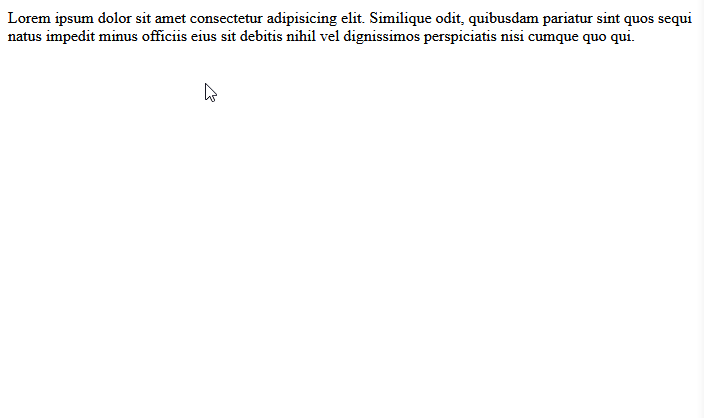

# Popups on Shopify
__April 15, 2024__

I was helping one of my clients with their Shopify website when I realised Shopify doesn't offer a built-in feature to have a popup appear to new users visiting the website. A feature like this would help immensely to streamline users to sign up for a mailing list.

By the end of this post, you should be able to create your own bare-bones email popup for your Shopify website. This guide will be for those who already know how to build websites with HTML/CSS/JavaScript, but I'll do my best to go step-by-step so even those without the experience can follow along.

## Approach
To get started, I tried a simple example of what I want to do, with as little code as possible. My goal was to have some text appear on the first visit, and then disappear if I visited the website again.

Therefore, I created this single HTML file with the CSS and JS embedded:
```html
<!DOCTYPE html>
<html lang="en">
<head>
    <style>
        .popup {
            display: none;
        }

        .popup.active {
            display: block;
        }
    </style>
</head>
<body>
    <div class="popup">
        <p>Subscribe for 10% off your first purchase.</p>
        <button class="form-button">
            Click here to sign up!
        </button>
    </div>

    <script>
        var first_visit = { timestamp: new Date().getTime() };
        var popupElement = document.querySelector(".popup");

        checkFirstVisit();
        function checkFirstVisit() {

            if (popupElement) {
                if (localStorage.getItem('has_visited')) {
                    const tenSeconds = 10000; // 1000 * 10;
                    var last_visit = JSON.parse(localStorage.getItem('has_visited'));
                    var moreThanTenSeconds = (new Date().getTime() - last_visit.timestamp < tenSeconds) ?
                        false : true;
                    if (moreThanTenSeconds) {
                         localStorage.removeItem('has_visited');
                         checkFirstVisit();
                     }
                 }
                 else {
                     localStorage.setItem('has_visited', JSON.stringify(first_visit));
                     popupElement.classList.add("active");
                 }
             }
         }
 
         document.querySelector(".form-button").addEventListener("click", () => {
             popupElement.classList.remove("active");
         });
     </script>
 </body>
 </html>
```

The key part is in the JavaScript, where the popup element is found and makes the popup appear based on one of the following conditions:
- The user visited for the first time
- It has been more than a day since their last visit
                
Now that the functionality is there, let's add some styling by updating the HTML and CSS (icon provided by [Iconoir](https://iconoir.com/)):
```html
<div class="popup">
    <div>
        
        
        <div class="popup-text">
            <p>Subscribe for 10% off your first purchase.</p>
            <button class="form-button">
                Click here to sign up!
            </button>
        </div>
    </div>
</div>
```
```css
.popup {
    display: none;
    width: 100vw;
    height: 100vh;
    justify-content: center;
    align-items: center;
    background-color: rgba(0, 0, 0, 0.5);
}

.popup.active {
    display: flex;
    position: absolute;
    left: 50%;
    top: 50%;
    transform: translate(-50%, -50%);
}

.popup-close {
    position: absolute;
    top: -10px;
    right: -10px;
}

.popup>div {
    background-color: white;
    display: flex;
    position: relative;
    min-width: 400px;
    width: 20%;
}

.popup-text {
    padding: 32px 12px;
}

#popup-image {
    object-fit: cover;
}
```
![Gif showing proper example][./assets/02.gif]

## Adding Code to Shopify
Shopify allows us to change the code within a theme, adding in our own custom components. This part will outline how to add the code above as a drag-and-drop component so we can easil y add it to existing pages on our Shopify account.

### Edit Code
Go to Online Store > Current Theme. Click the three dots and select 'Edit Code' from the dropdown.
![Screenshot of Shopify clicking the theme's 'Edit Code' function]['./assets/03.png']

### Add a New Section
On the left side, find the 'Section' folder and select 'Add a new section'. In the menu that appears, name it **email-popup** and make sure the file type is set to **liquid**.
![Screenshot showing 'Add a New Section' button ]['./assets/add-section.png']

Then copy-and-paste the following content in this liquid file:

```html
{{ 'popup.css' | asset_url | stylesheet_tag }}

<div class="color-{{ section.settings.color_scheme }}">
  
  
  <div class="popup-text">
    <h2>{{ section.settings.title }}</h2>
    <button class="button form-button">{{ section.settings['button-text'] }}</button>
  </div>
</div>
<script>
  var first_visit = { timestamp: new Date().getTime() };
  var popupElement = document.querySelector(".popup");

  checkFirstVisit();
  function checkFirstVisit() {

      if (popupElement) {
          if (localStorage.getItem('has_visited')) {
              const aDay = 1440000;
              var last_visit = JSON.parse(localStorage.getItem('has_visited'));
              var moreThanADay = (new Date().getTime() - last_visit.timestamp < aDay) ? false : true;
              if (moreThanADay) {
                  localStorage.removeItem('has_visited');
                  checkFirstVisit();
              }
          }
          else {
              localStorage.setItem('has_visited', JSON.stringify(first_visit));
              popupElement.classList.add("active");
          }
      }
  }

  document.querySelector(".form-button").addEventListener("click", () => {
    popupElement.classList.remove("active");
    const footer = document.querySelector(".footer");
    footer.scrollIntoView({behavior: "smooth"});
  });

  document.querySelector(".popup-close").addEventListener("click", () => {
      popupElement.classList.remove("active");
  });
</script>


{
  "name": "Email Popup",
  "tag": "div",
  "class": "popup",
  "limit": 1,
  "settings": [
    {
      "type": "color_scheme",
      "id": "color_scheme",
      "label": "t:sections.all.colors.label",
      "default": "scheme-1"
    },
    {
      "type": "text",
      "id": "title",
      "label": "email-popup-text",
      "default": "Subscribe for 10% off your first purchase."
    },
    {
      "type": "text",
      "id": "button-text",
      "label": "button-text",
      "default": "Go to newsletter signup"
    }
  ],
  "presets": [
    {
      "name": "Email Popup"
    }
  ]
}

```

To change the picture that appears in the popup, change the name 'bowl.webp' to the name of the image you'd like to have appear.

### Add New Assets
Now we'll add the following assets: the CSS file containing all of the styling information, an icon for closing the popup, and an image that appears with the popup.

On the left side, find the 'Assets' folder and select 'Add a new asset'. In the menu that appears, name it **popup** and make sure the file type is set to **css**.
![Screenshot showing 'Add a New Asset' button ]['./assets/add-asset.png']

Then copy-and-paste the following content in the CSS file:

```css
.popup {
  display: none;
  width: 100vw;
  height: 100vh;
  justify-content: center;
  align-items: center;
  background-color: rgba(0, 0, 0, 0.5);
}

.popup.active {
  display: flex;
  position: absolute;
  left: 50%;
  top: 50%;
  transform: translate(-50%, -50%);
}

.popup-close {
  position: absolute;
  top: -10px;
  right: -10px;
}

.popup > div {
  background-color: white;
  display: flex;
  position: relative;
  min-width: 400px;
  width: 25%;
}

.popup-text {
  padding: 32px 12px;
}

#popup-image {
  object-fit: cover;
}
```

Now do the same thing for your image and icon but don't set the file type to **css**. (For the icon, I used *xmark-solid-circle* on [Iconoir]('https://iconoir.com/'))

### Adding the Email Popup Section
Woo! We got past the code part, now onto adding the email popup to the website.

Go back to the Online Store > Current Theme menu and select 'Customize'.

Now you should be in the website builder. Select 'Add section' within the 'Header' group, and our 'Email Popup' section should appear. Select it.
![Screenshot showing where to add the 'Email Popup' section within Shopify's website builder]['./assets/add-email-popup.jpg']

You can customize the message on the popup as well as the text on the button.
![Screenshot showing where to editable fields to change the text of the popup]['./assets/edit-email-popup.jpg']

Save the website and now when you preview it, the popup should appear!
![Gif showing the pop-up functionality on the Shopify website.][./assets/final.gif]